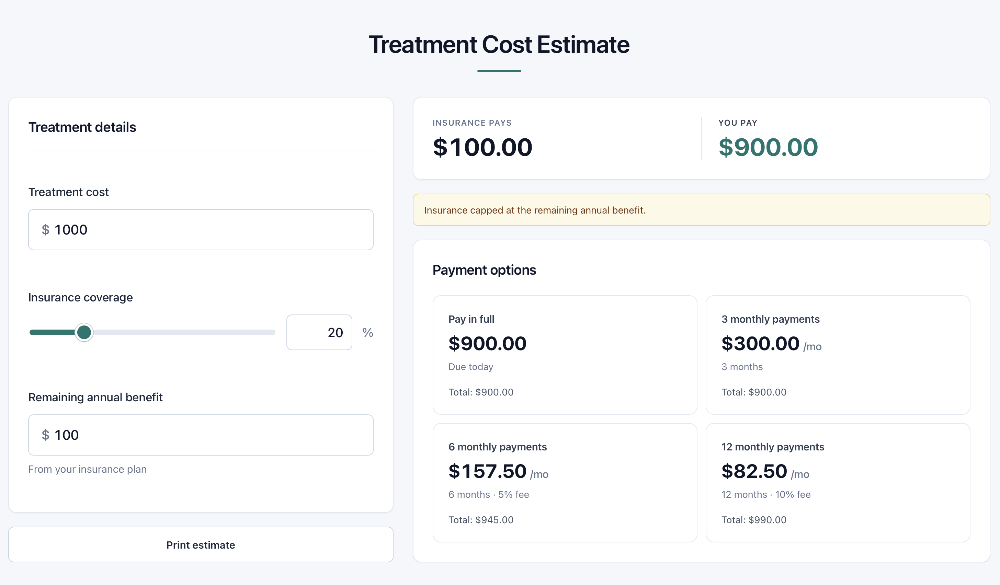

# Dental Treatment Financing Calculator

A web tool a dental office manager can use, in front of a patient, to walk through what insurance covers, what the patient owes, and a few payment plan options — updating in real time as the numbers change.

**Live demo:** https://dentalfinancing.vercel.app



**Inputs**
- Treatment amount (default $1,000)
- Insurance coverage % (0–100, slider + numeric input)
- Remaining annual insurance benefit

**Outputs**
- Insurance covered amount — capped at the remaining annual benefit
- Patient out-of-pocket
- Payment options, each with the monthly amount:
  - Pay in full
  - 3 months — no fee
  - 6 months — 5% fee
  - 12 months — 10% fee

## How to run

Requires Node 18+.

```bash
npm install
npm run dev       # http://localhost:5173
npm test          # vitest
npm run build     # type-check + production build
npm run preview   # serve the built bundle
```

## Project structure

```
src/
  domain/        pure calc + money helpers + tests
  components/    UI, prop-drilled state
  index.css      all styling
```

## Calculation logic

1. estimate     = treatment × coverage%
2. covered      = min(estimate, remaining benefit)
3. out-of-pocket = treatment − covered
4. monthly      = (out-of-pocket × (1 + fee)) / months 
5. Monthly payments reconcile to the rounded total: residual cents go on the last payment.

All money is held internally as integer cents; the display layer formats to two decimal places via `Intl.NumberFormat`. 

## Assumptions

- All amounts are in USD with two-decimal precision. Sub-cent amounts and non-US currency are out of scope.
- Insurance never goes negative — capped at min(coverage% × treatment, remaining benefit).
- Coverage clamped to 0–100; treatment and remaining-benefit clamped to ≥ 0. Negative and non-finite (NaN, Infinity from parsing an empty string) inputs are coerced to zero rather than rejected 
- All money math is done in integer cents: round to nearest cent at every multiplication step.
- Payments must reconcile in all situations (e.g., 3 payments on a $100.00 bill must sum to exactly $100.00 `[$33.33, $33.33, $33.34]`). If there is a remainder when dividing payments, it goes on the final payment.


## Tradeoffs and design decisions


- **Asymmetric two-column layout** The UI is designed to be easy for a dentist or receptiontist to show patient. The inputs sit in a smaller left column (That will be guided by receptionist). The outputs, coverage amount and payment plan options fill a larger right column that is easy for the patient to see. The user interface is minimalist with large high contrast number making it easy for any user to understand even at some distance. The "Print Estimate" button is also designed to make it easy to hand patient a quick summary of thier options.
- **Real-time calc on every keystroke.** The math takes microseconds, so easy and relevant to update live. Allows dentist to give patient a live view of their expected out of pocket cost at different coverage amounts. 
- **Single-step fee rounding.** total = round(oop × (1 + fee)) is computed in one rounding pass, not as oop + round(oop × fee). The latter double-rounds and can drift by a cent.
- **Integer cents in a small helper rather than a library.**  Money represented as integer cents in a small helper rather than a library. This avoids runtime dependency for about 30 lines of code. If the calculator expanded to multi-currency support or more advanced math, I'd switch to a library.
- **Branded TypeScript type:** Branded Typescript type: type Cents = number & { __brand: 'Cents' } used instead of wrapper class. Values stay as normal numbers at runtime - zero overhead and easy to inspect in debugger while the compiler still prevents passing dollars where 
cents are expected. 
- **Residual on the last payment** instead of distributing across the first N. Last payment is at most N−1 cents larger than the others (≤ 11¢ for 12 months) 
- **Pay-in-full as a one-month plan** Pay in full is modeled as a one month plan with no fee instead of a special case. Lets the schedule iterate over a uniform FinancingPlan[]. The UI layer special-cases the label ("Due today" vs. "1 monthly payment").
- **Financing Options in config file** The financing fee schedules should be easy to change, so they live in a config file rather than being embedded in the UI.


## What I'd improve with more time

- A polished PDF export of the patient handout, instead of relying on the browser's print dialog.
- An APR-based financing mode behind a toggle, for comparison with the flat-fee model. Current version uses a flat percentage, but a more realistic version would have an amortizing apr for comparison with the flat-fee model. This could be useful when evaluating alternative financing partners.
- A small Playwright end-to-end test covering the full input to result flow at the browser level.
- Personalize with clinic branding + procedure name + patient name on the estimate.
- An "email estimate" feature that emails the PDF to a patient 


